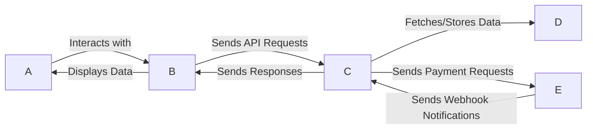

# 🎓 SchoolPay - Modern School Payment System  

A **full-stack web application** for managing school payments securely and efficiently.  
It consists of:  
- **Backend Microservice** (Node.js, Express, MongoDB, Payment Gateway Integration)  
- **Frontend Application** (React, TailwindCSS, JWT Authentication)  

---

## 📑 Table of Contents  

- [Project Overview](#project-overview)  
- [Features](#features)  
- [Technologies Used](#technologies-used)  
- [System Architecture](#system-architecture)  
- [Setup and Installation](#setup-and-installation)  
  - [Backend Setup](#backend-setup)  
  - [Frontend Setup](#frontend-setup)  
- [Environment Variables](#environment-variables)  
- [API Usage Examples](#api-usage-examples)  
- [Folder Structure](#folder-structure)  
- [Authentication Flow](#authentication-flow)  
- [Testing](#testing)  
- [Contributing](#contributing)  
- [License](#license)  
- [Contact](#contact)  

---

## 🚀 Project Overview  

SchoolPay is a **secure and scalable MERN-based school payment system** that provides seamless interaction between school administrators, parents, and a third-party payment gateway.  

- **Backend (Express.js + MongoDB Atlas):**  
  - Handles user authentication (JWT)  
  - Creates and processes payment orders  
  - Integrates securely with Edviron payment gateway  
  - Manages transactions, webhooks, and user data  

- **Frontend (React + TailwindCSS):**  
  - User-friendly responsive dashboard  
  - Authentication and profile management  
  - Transaction overview with filtering and CSV exports  
  - Dark mode support for modern UI  

---

## ✨ Features  

- 🔐 **Secure Authentication** (JWT + bcrypt)  
- 💳 **Payment Integration** with order creation and webhook callbacks  
- 📊 **Transactions Dashboard** with history, filtering, and export  
- 🔄 **Webhook Support** for real-time payment status updates  
- ✅ Input validation & error handling  
- 🌙 **Modern UI with TailwindCSS**  
- 📱 Responsive across devices  

---

## 🛠️ Technologies Used  

### Backend  
- Node.js  
- Express.js  
- MongoDB Atlas + Mongoose  
- JWT for Authentication  
- Bcrypt for Password Hashing  
- Express-validator  
- Axios (API requests)  
- Dotenv  

### Frontend  
- React 18 (Functional Components + Hooks)  
- React Router v6  
- TailwindCSS (Dark mode support)  
- Axios  
- Vite (React build tool)  

---

## 🏗️ System Architecture  




---

## ⚙️ Setup and Installation  

### Backend Setup  

#### Prerequisites  
- Node.js (v14+)  
- MongoDB Atlas account  
- Edviron Payment API credentials  

#### Steps

1. **Clone the repository**
```bash
   git clone https://github.com/RAJATKUMARSINGH527/School-Payments-Application.git
   cd School-Payments-Application
```

3. **Install dependencies**

```bash
npm install
```
3. **Configure environment variables**
Create a .env file in the root directory and add:

```env
MONGODB_URL=mongodb+srv://<your-mongodb-uri>
JWT_SECRET_KEY=your_jwt_secret
SALT_ROUNDS=10
PAYMENT_API_KEY=your_payment_api_key
PG_KEY=your_pg_secret_key
SCHOOL_ID=65b0e6293e9f76a9694d84b4
PORT=3000
NODE_ENV=development
```
4. **Run the server**

```bash
npm run server
```
Your server will start at:

API Base URL: `http://localhost:3000`  

---

### Frontend Setup  

#### Prerequisites  
- Node.js v16+  
- npm or yarn  
- Running backend instance  

#### Steps

1. **Clone the repository**

```bash
git clone https://github.com/RAJATKUMARSINGH527/School-Payments-Application.git
cd School-Payments-Application
```

3. **Install dependencies**

```bash
npm install
```

4. **Run the server**

```bash
npm run dev
```
**Frontend Server**

Frontend will run at [http://localhost:5173](http://localhost:5173).  

---

## 🔑 Environment Variables  

| Variable          | Description                            |
| ----------------- | -------------------------------------- |
| `MONGODB_URL`     | MongoDB Atlas URI                      |
| `JWT_SECRET_KEY`  | JWT signing secret                     |
| `SALT_ROUNDS`     | bcrypt salt rounds                     |
| `PAYMENT_API_KEY` | Payment provider API key               |
| `PG_KEY`          | Payment gateway JWT signing key        |
| `SCHOOL_ID`       | Unique school ID                       |
| `PORT`            | Backend server port                    |
| `NODE_ENV`        | development / production               |

---

## 📌 API Usage Examples  

### User Registration  

```http
POST /auth/register
Content-Type: application/json
```
```json
{
  "username": "admin",
  "email": "admin@example.com",
  "password": "adminpass123"
}
```

**🔹 User Login**
```http
POST /auth/login
Content-Type: application/json
```
```json
{
  "email": "admin@example.com",
  "password": "adminpass123"
}
```
✅ Response includes JWT token for authorization.

### Payment Order 

```http
POST /orders/create-payment
Authorization: Bearer <JWT_TOKEN>
Content-Type: application/json
```
```json
{
  "school_id": "65b0e6293e9f76a9694d84b4",
  "trustee_id": "652e0a1a87fa11c9d194b002",
  "student_info": {
    "name": "Raj Kumar",
    "id": "STU001",
    "email": "student1@example.com"
  },
  "gateway_name": "EdvironPay",
  "amount": 2500,
  "custom_order_id": "ORD20250921A",
  "callback_url": "https://your-callback-url.com"
}
```

### Webhook  

```http
POST /webhook
Content-Type: application/json
```
```json
{
  "order_info": {
    "order_id": "652e0a1a87fa11c9d194b001",
    "order_amount": 2500,
    "transaction_amount": 2500,
    "payment_mode": "card",
    "payment_details": "Visa **** 1234",
    "bank_reference": "ICIC122",
    "payment_message": "Transaction successful",
    "status": "SUCCESS",
    "error_message": "NA",
    "payment_time": "2025-09-21T03:00:00.000+00:00",
    "custom_order_id": "ORD20250921A"
  }
}
```

Handles real-time payment status updates from gateway.  

---

## 📂 Folder Structure  

### Backend  

```pgsql
/
├─ config/ # Database connection
├─ middlewares/ # JWT, validation, error handlers
├─ models/ # Mongoose schemas (User, Order, Transaction)
├─ routes/ # Route controllers
├─ utils/ # Payment API integration
├─ index.js # Main entry
```

### Frontend  

```pgsql
src/
├─ components/ # UI Components (Navbar, Footer, Home, etc.)
├─ pages/ # (Login, Signup, TransactionsOverviewPage, etc.)
├─ App.jsx # Routing with auth guards
├─ main.jsx # Entry
```

---

## 🔐 Authentication Flow  

1. User signs up or logs in → Backend issues JWT.  
2. Frontend stores token in **localStorage**.  
3. Axios sends JWT in `Authorization` headers.  
4. Protected routes require JWT (checked in middleware).  
5. Expired/invalid tokens return 401 → redirect to login.  

---

## 🧪 Testing  

- Manual testing via **Postman** collection provided.  
- Frontend tested with mocked backend tokens.  
- Planned: Jest + React Testing Library for frontend.  

---

## 🤝 Contributing  

1. Fork the repo.  
2. Create a feature branch.  
3. Commit changes.  
4. Push to branch & open a Pull Request.  

---

## 📜 License  

This project is licensed under the **MIT License**.  

---

## 📬 Contact  

**Developer:** Rajat Kumar Singh  
- Email: [rajatkumarsingh257@example.com](mailto:rajatkumarsingh257@example.com)  
- GitHub: [RAJATKUMARSINGH527](https://github.com/RAJATKUMARSINGH527)  
